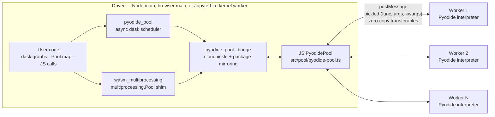

# 🐍⚡ Pyodide Worker-Pool Parallelism

🔗 [Live Demo](https://fideus-labs.github.io/python-wasm-parallelism/)

Parallel CPU-bound Python in WebAssembly: a pool of Web Workers (browser)
or `worker_threads` (Node), each hosting its own [Pyodide](https://pyodide.org)
interpreter, coordinated over message passing — with two familiar Python
parallelism APIs layered on top.

A single Pyodide interpreter is strictly single-threaded (no `-pthread`, no
`fork`), so parallelism means *many interpreters*. This project builds that
substrate once and exposes it three ways:

- **🟨 JS API** — `PyodidePool`: run Python snippets or cloudpickled calls
  across the pool (`runPython`, `map`, `runPickled`, `mapPickled`), with
  parallel warm boot, LIFO worker recycling, progress, and cancellation.
- **🔀 dask backend** — `await pyodide_pool.compute(...)`: an async scheduler
  running in a "driver" Pyodide instance executes `dask.delayed` /
  `dask.bag` / dask-array graphs in parallel on the pool, with automatic
  package mirroring (driver has numpy ⇒ workers install it on first task).
- **🧩 `multiprocessing` shim** — `from wasm_multiprocessing import Pool`:
  stdlib-shaped `Pool`/`AsyncResult` so existing `multiprocessing` code
  runs after changing one import line — async-native (`amap`, `aapply`, …)
  everywhere, genuinely blocking `map`/`get` where JSPI allows it.

Everything runs in Node, in a browser page (Vite demo), and inside
JupyterLite — where the Pyodide kernel is itself a Web Worker and the pool
spawns *nested* workers.

## 🏗️ Architecture



The **driver** coordinates and never computes; **workers** are stateless
between tasks — every task message carries a cloudpickled call plus a
package snapshot the worker replays idempotently (first task pays the
install, later tasks skip it). Queuing/recycling comes from
[`@fideus-labs/worker-pool`](https://www.npmjs.com/package/@fideus-labs/worker-pool);
results re-raise the original Python exception on the driver with the
remote traceback chained. The whole stack is **async-first**: blocking a
driver thread starves the event loop the pool lives on (measured, not
assumed — see the [spikes](docs/architecture/spikes/)), so synchronous
facades exist only where JSPI stack-switching makes them safe.

Measured on 4 workers: ~3× on pure-Python prime counting, Node and browser
within 4% of each other; per-task floor ~0.7 ms + ~10 ms/MiB of payload;
~1.1–1.4 s one-time boot per worker. Details in the
[benchmark reports](docs/benchmarks/).

## 📁 Layout

| Path | What it is |
| --- | --- |
| `src/` | JS/TS core: `PyodidePool`, the worker protocol (`exec`, `execPickled`, `ping`), browser bundle entry |
| `python/pyodide_pool/` | Driver-side Python package: `_bridge` (cloudpickle + JS interop), async dask `scheduler`, package mirroring, JupyterLite `loader` |
| `python/wasm_multiprocessing/` | The `multiprocessing.Pool` shim (own pure-Python wheel, depends on `pyodide-pool`) |
| `examples/` | Node demos: raw pool (`demo:node`), dask scheduler (`demo:dask`) |
| `web/` | Vite browser demo (COOP/COEP dev server, `window.__demo` hook) |
| `demos/jupyterlite/` | JupyterLite site: 5 notebooks + wheels + the Minnesota-lakes dataset, kernel spawns the pool as nested workers; deployed to GitHub Pages by `.github/workflows/deploy-pages.yml` |
| `tests/` | Vitest suites (pool, worker, bundle, driver Python, dask, loader, multiprocessing) |
| `e2e/` | Playwright: browser demo specs, JupyterLite smoke tests, `@bench` benchmark spec |
| `bench/` | Node benchmark harness + report generators (writes `docs/benchmarks/`) |
| `docs/` | The knowledge base — [map below](#documentation-map) |

## 🚀 Quick start

Prerequisites:

- **Node ≥ 24** (developed on v24.18) — `npm install`
- **[uv](https://docs.astral.sh/uv/)** on `PATH` — builds the pure-Python
  wheels (`build:lite`, wheel checks)
- For browser tests: `npx playwright install chromium`
- For the JupyterLite build: a local venv the build script invokes as
  `.venv/bin/jupyter` — `uv venv && uv pip install jupyterlite-core
  jupyterlite-pyodide-kernel`

Entry points:

| Command | What it does |
| --- | --- |
| `npm run demo:node` | Raw-pool Node demo: prime counting serial vs parallel `pool.map()`, prints speedup |
| `npm run demo:dask` | Dask Node demo: `delayed` reduction, `dask.bag`, and numpy package mirroring via `await pyodide_pool.compute(...)` |
| `npm test` | Vitest suite (pool, worker protocol, driver Python, dask scheduler, loader, multiprocessing shim) |
| `npm run test:browser` | Playwright: Vite-demo specs + JupyterLite notebook smoke tests in headless Chromium |
| `npm run bench` | Node benchmark matrix (pool sizes × workloads), writes JSON + regenerates [node-benchmarks](docs/benchmarks/node-benchmarks.md) |
| `npm run bench:report` / `bench:report:browser` | Regenerate the benchmark reports from recorded JSON |
| `npm run build:lite` | Build browser bundle + both wheels into the JupyterLite site, then `jupyter lite build` |
| `npm run serve:lite` | Serve the built JupyterLite site (COOP/COEP headers) at http://localhost:8000 |
| `npm run dev` | Vite dev server for the browser demo (cross-origin isolated) |
| `npm run typecheck` | `tsc --noEmit` for both the root and `web/` projects |

The three APIs in one glance:

```python
# dask backend (driver Pyodide; dask installed via micropip)
import pyodide_pool
total = await pyodide_pool.compute(dask.delayed(sum)([...]))

# multiprocessing shim — was: from multiprocessing import Pool
from wasm_multiprocessing import Pool
with Pool(4) as pool:
    counts = await pool.amap(count_primes, ranges)   # portable everywhere
    counts = pool.map(count_primes, ranges)          # blocks for real under JSPI
```

```ts
// JS pool — each chunk is injected into the snippet's namespace as `item`
const pool = new PyodidePool({ poolSize: 4, workerUrl })
const counts = await pool.map(PRIME_SNIPPET, chunks).promise
```

For JupyterLite, run `npm run build:lite && npm run serve:lite` and open
http://localhost:8000/lab/index.html — the five notebooks
(`00-scipy-lightning`, `01-pool-basics`, `02-dask-parallel`,
`03-benchmark`, `04-multiprocessing`) are self-contained, run top to
bottom. `00-scipy-lightning.ipynb` is a 3-minute SciPy lightning-talk
demo: it maps the density of all 13,462 Minnesota lakes (10+ acres, DNR
Hydrography — regenerate the CSV with `uv run
scripts/make-mn-lakes-data.py`) via a billion-evaluation Gaussian KDE as
a dask graph, serial vs pool. Pushing `main` deploys the built site to
GitHub Pages (`.github/workflows/deploy-pages.yml`); the pool is
postMessage-based, so it needs no COOP/COEP headers there. Once Pages is
enabled, the talk URL is
`https://<owner>.github.io/<repo>/lab/index.html?path=00-scipy-lightning.ipynb`.

## 📚 Documentation map

**🔬 Research** (Phase 01 groundwork — [index](docs/research/index.md)):

- [pyodide-parallelism](docs/research/pyodide-parallelism.md) — platform
  ground truth: workers, Node, SharedArrayBuffer/COOP-COEP, the
  `Atomics.wait` asymmetry, JSPI
- [worker-pool-api](docs/research/worker-pool-api.md) — the
  `@fideus-labs/worker-pool` contract: task shape, recycling, batch runs
- [dask-schedulers](docs/research/dask-schedulers.md) — dask's pluggable
  scheduler seam and why a blocking scheduler deadlocks the browser
- [multiprocessing-on-wasm](docs/research/multiprocessing-on-wasm.md) —
  why stdlib `multiprocessing` fails under Emscripten and what can be
  honestly emulated

**📐 Architecture** (the designs, written before the code):

- [dask-scheduler-design](docs/architecture/dask-scheduler-design.md) —
  driver/worker topology, cloudpickle wire format, the async graph
  executor, package mirroring, error propagation
- [multiprocessing-shim-design](docs/architecture/multiprocessing-shim-design.md)
  — API mapping table, `chunksize` semantics, the spike-validated blocking
  strategy (JSPI vs Atomics), out-of-scope list
- [dask-vs-multiprocessing](docs/architecture/dask-vs-multiprocessing.md)
  — the closing comparison: ergonomics, porting cost, graphs vs flat
  maps, measured overheads, when to use which
- [spikes/](docs/architecture/spikes/) — the re-runnable Node/browser
  blocking-behavior spikes the strategy is grounded in

**📊 Benchmarks** (regenerated from recorded JSON by `bench:report*`):

- [node-benchmarks](docs/benchmarks/node-benchmarks.md) — pool sizes 1–8 ×
  four workloads, boot/dispatch/serialization floors
- [browser-benchmarks](docs/benchmarks/browser-benchmarks.md) — headless
  Chromium via the `@bench` Playwright spec, plus the Node-vs-browser delta

## 📄 License

[MIT](LICENSE.txt)
