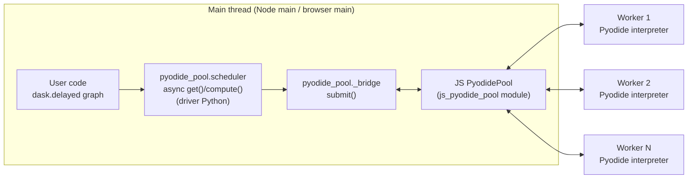

# Dask Async Scheduler on the Pyodide Worker Pool — Design

Phase 02 turns the Phase 01 worker pool ([[phase-01-results]]) into a dask
execution backend: a scheduler that runs **inside a "main" Pyodide instance**
and executes dask task graphs in parallel by dispatching individual tasks to
the pool. The user-visible contract is

```python
result = await pyodide_pool.compute(delayed_obj)
```

producing the same answers as dask's synchronous scheduler, faster. The
research grounding is [[dask-schedulers]] (scheduler seam, async requirement,
cloudpickle transport) and [[worker-pool-api]] (pool task contract); this
document fixes the concrete architecture.

## Topology: one driver, N stateless workers



- The **driver** is a full Pyodide instance on the main thread. It runs the
  user's code (graph construction), dask itself (installed via micropip —
  dask is not in the Pyodide distribution), and our scheduler package
  `pyodide_pool`. Nothing CPU-heavy runs here; the driver only coordinates.
- The **JS `PyodidePool`** (`src/pool/pyodide-pool.ts`) is created in plain
  JS and handed to driver Python via
  `pyodide.registerJsModule('js_pyodide_pool', { pool })`. Driver code then
  does `import js_pyodide_pool` and calls pool methods through Pyodide's FFI;
  the returned JS promises are directly awaitable from Python.
- **Workers** are the Phase 01 pool workers: one isolated Pyodide interpreter
  each, warm after first boot thanks to LIFO recycling, communicating over
  the existing one-request/one-response `id`-matched message protocol.
  Workers are **stateless between tasks** — every task ships everything it
  needs (code, arguments, package list); no shared cache is assumed.

The driver/worker split mirrors dask.distributed's client/worker topology,
collapsed onto one machine: the scheduler is ordinary Python running where
the graph lives, and only leaf task execution crosses the message boundary.

## Task wire format: cloudpickle over transferable buffers

A dispatched task is exactly one Python call. The canonical payload is

```python
payload: bytes = cloudpickle.dumps((func, args, kwargs))
```

- **cloudpickle, not pickle** — it serializes functions *by value*, so
  lambdas, closures, and interactively defined functions (i.e. everything a
  dask graph contains) survive the trip. cloudpickle ships in the Pyodide
  distribution (3.1.1 in Pyodide 0.28.x), so both sides always have it, and
  since every worker runs the identical Pyodide build there is no
  cross-version pickle skew.
- Driver side, the `bytes` convert to a JS buffer via `pyodide.ffi.to_js`
  (a `Uint8Array` copy); the JS layer posts the underlying `ArrayBuffer`
  **as a transferable** so the driver→worker hop is zero-copy.
- Worker side: `func, args, kwargs = cloudpickle.loads(payload)`, call
  `func(*args, **kwargs)`, `cloudpickle.dumps(result)`, post the result
  buffer back — again as a transferable.
- Results are opaque bytes to JS. Unlike the Phase 01 `exec` path there is no
  `toJs`/JSON conversion chain: arbitrary picklable Python objects (numpy
  arrays included) round-trip without structured-clone concerns.

## Worker protocol extension: `execPickled`

New request alongside `exec`/`ping` in `src/worker/pyodide-worker.ts`:

```ts
interface ExecPickledRequest {
  id: number
  kind: 'execPickled'
  payload: ArrayBuffer          // cloudpickle.dumps((func, args, kwargs))
  packages: string[]            // Pyodide-distribution packages to mirror
  wheels: string[]              // micropip targets (PyPI names / wheel URLs)
}
// success: { id, ok: true, payload: ArrayBuffer, bootMs, execMs }
// failure: { id, ok: false, error: WorkerErrorInfo }  // + pickled exception, below
```

Handling order per message:

1. `ensurePyodide()` (existing) — boot or reuse the module-scope interpreter.
2. **Ensure packages**: `pyodide.loadPackage(packages)` for distribution
   packages, `micropip.install(wheels)` for the rest. The worker keeps a
   module-scope set of already-installed names so replaying the same snapshot
   on every message is cheap and idempotent — a recycled worker skips
   installs it has already done, a fresh worker catches up automatically.
   (This extends the existing `ensurePackages`, which already checks
   `pyodide.loadedPackages`; the set adds wheel names that don't appear
   there.)
3. `cloudpickle.loads` the payload, execute, `cloudpickle.dumps` the result.
   Execution happens through a small, fixed Python shim evaluated in the
   worker (unpickle → call → repickle) so no per-task Python source is
   generated; `await`-ability of `func` results can be added later if needed.
4. Post the response with the result buffer in the transfer list.

The pool-side contract from Phase 01 is preserved: protocol tasks always
*resolve* with a `WorkerResponse` (a rejected task would permanently shrink
the worker-pool), errors are unwrapped after recycling, and the exchange
stays one-request/one-response matched on `id`. The only mechanical change to
`PyodidePool.exchange` is an optional transfer list on `postMessage` (the
`web-worker` Node polyfill forwards transfer lists to `worker_threads`).

New `PyodidePool` methods, both built on `pool.runTasks` so progress
reporting and `cancel(runId)` keep working:

```ts
runPickled(payload: ArrayBuffer, opts: { packages?: string[]; wheels?: string[] }): Promise<ArrayBuffer>
mapPickled(payloads: ArrayBuffer[], opts): PyodideMapRun<ArrayBuffer>
```

## Driver-side Python package: `python/pyodide_pool/`

```
python/pyodide_pool/
├── __init__.py    # public API: WorkerPool, compute, get
├── _bridge.py     # JS-pool wrapper: async submit(func, /, *args, **kwargs)
├── _packages.py   # package-mirroring snapshot helpers
└── scheduler.py   # the async dask graph executor
```

- `_bridge.submit(func, /, *args, **kwargs)` is the single choke point:
  cloudpickle the call triple, convert to a JS buffer, invoke
  `js_pyodide_pool`'s `runPickled` with the current package snapshot, `await`
  the JS promise (Pyodide's WebLoop makes JS promises awaitable), convert the
  returned buffer back to `bytes`, unpickle, return — or re-raise the remote
  exception (see error propagation).
- **No hard dask import at module top level.** `scheduler.py` imports dask
  lazily inside `get`/`compute`; `__init__`/`_bridge`/`_packages` never
  import it. This keeps the package reusable as the substrate for the
  Phase 06 multiprocessing shim, which has no dask dependency.
- The package is pure Python. It is installed into the driver (written into
  Pyodide's FS or installed from a locally built wheel) but **never installed
  in workers** — worker-executed helpers travel inside the cloudpickle
  payload via `cloudpickle.register_pickle_by_value(pyodide_pool)` (see
  package mirroring).

## Scheduler algorithm: async in-degree graph executor

`scheduler.get(dsk, keys)` implements the classic Kahn-style executor over
the raw graph dict, made async. Graph utilities come from dask
(`dask.core.get_dependencies`, `dask.core.istask`, `dask.core.flatten`,
`dask.core.toposort` for cycle detection/validation) rather than hand-rolled
code.

```python
async def get(dsk, keys, **kwargs):
    dsk = dict(dsk)
    dependencies = {k: get_dependencies(dsk, k) for k in dsk}
    dependents   = reverse_dict(dependencies)
    indegree     = {k: len(v) for k, v in dependencies.items()}
    cache, pending = {}, {}          # key -> value; key -> asyncio future

    def dispatch(key):               # literals resolve locally, tasks go remote
        node = dsk[key]
        if not istask(node):
            cache[key] = resolve_literal(node, cache)   # incl. key aliases
            return finish(key)                          # may ready dependents
        func, args, kwargs_ = normalize(node, cache)    # substitute dep VALUES
        pending[key] = asyncio.ensure_future(_bridge.submit(func, *args, **kwargs_))

    for key in (k for k, d in indegree.items() if d == 0):
        dispatch(key)                                   # all ready tasks at once
    while pending:
        done, _ = await asyncio.wait(pending.values(), return_when=FIRST_COMPLETED)
        for key in completed(done):                     # store result, then:
            for dep in dependents[key]:
                indegree[dep] -= 1
                if indegree[dep] == 0:
                    dispatch(dep)                       # newly-ready fan-out
    return nested_get(keys, cache)                      # handles nested key lists
```

Key decisions:

- **Dispatch everything that is ready, immediately.** The scheduler does not
  know or care about `num_workers`; the JS pool's queue bounds actual
  concurrency at `poolSize`. Over-dispatching just fills the pool queue,
  which is exactly what we want for utilization.
- **Values, not references.** Before pickling, `normalize` substitutes
  already-computed dependency values from `cache` into the task's argument
  structure (recursively, per the dask graph spec's nested tuple/list/dict
  forms). Workers are stateless — every payload is self-contained. Nested
  sub-task expressions inside a task are evaluated by a tiny recursive
  evaluator defined in `pyodide_pool` itself, which travels by value inside
  the payload, so **workers never need dask installed** for the legacy-tuple
  graph dialect. Graphs whose nodes are modern `dask._task_spec` objects
  (dask ≥ 2024.12) pickle by reference to the `dask` module; they execute on
  workers because package mirroring ships dask there when the driver has it.
- **Failures fail fast.** The first task exception cancels the outstanding
  asyncio futures, and the original Python exception re-raises on the driver
  with its remote traceback attached (below). Later phases can add
  partial-failure modes if needed.
- `compute(*collections)` is the user-facing wrapper:
  `dask.base.collections_to_dsk(collections)` (equivalently
  `__dask_graph__()`) materializes the graph, `__dask_keys__()` names the
  outputs, `get(...)` executes, and `__dask_postcompute__()`'s finalize
  functions assemble the results — so `dask.delayed`, `dask.bag`, and dask
  arrays all work through the one entry point.
- Memory: Phase 02 keeps every computed value in `cache` until `get`
  returns. dask.local's eager release via `waiting_data` refcounts is a
  known follow-up (worth it for large array graphs), noted here so the
  deviation is deliberate.

## Why the scheduler must be async

Documented in depth in [[dask-schedulers]]; the design consequences:

- Worker replies arrive as JS `message` events, which are only delivered
  when the JS event loop turns. A scheduler that dispatches and then
  **blocks** (dask.local's `queue.get()`) never yields, so on the browser
  main thread the completion events can never fire — a deadlock by
  construction, not just jank. `Atomics.wait` is banned on the browser main
  thread, so there is no legal blocking escape hatch.
- Therefore the executor is a coroutine on Pyodide's event loop (`WebLoop`),
  which schedules Python coroutines on the JS microtask queue. The bridge is
  native: **a JS `Promise` is directly awaitable in Pyodide Python** (the
  FFI wraps it as an asyncio future on the WebLoop), so
  `await js_pool.runPickled(...)` suspends the Python coroutine and resumes
  it from the JS `then` callback. `asyncio.wait(..., FIRST_COMPLETED)`
  replaces `queue.get()` as the completion multiplexer.
- Because dask's `compute(scheduler=...)` protocol is synchronous with no
  async variant, our executor is surfaced as `await pyodide_pool.compute(...)`
  / `await pyodide_pool.get(...)` rather than through `scheduler=`. A
  synchronous facade can be layered on later where blocking is legal (Node
  main thread, workers) or via JSPI `run_sync` — out of scope for Phase 02.

## Package mirroring

User tasks reference whatever the user imported in the driver (numpy, etc.).
Workers must be able to satisfy those imports without user intervention.

- **Snapshot** (`_packages.snapshot_packages()`): the set of
  Pyodide-distribution packages from the JS side's `pyodide.loadedPackages`
  (driver instance) plus micropip-installed wheels from `micropip.list()`
  (driver Python). Split into `packages` (distribution: `pyodide.loadPackage`
  on the worker) and `wheels` (micropip names/URLs).
- **The snapshot rides on every `execPickled` message.** There is no separate
  sync protocol or driver↔worker package negotiation: the worker's
  module-scope installed-set makes replay idempotent and near-free, and a
  fresh (or recycled-after-terminate) worker converges automatically on its
  first task. Phase 02 verifies this replay-cheapness rather than building
  sync machinery.
- **Filtered out of the snapshot**: `pyodide_pool` itself (shipped by value —
  `cloudpickle.register_pickle_by_value(pyodide_pool)` at import time, so
  scheduler helpers embedded in payloads never require the package on
  workers), and anything meaningless to mirror (micropip itself,
  already-universal pieces like cloudpickle which the worker loads as part
  of the `execPickled` shim).
- **Acceptance check**: driver loads numpy, submits a lambda that uses numpy;
  the worker auto-installs numpy from the snapshot and returns the correct
  array result. First task on each worker pays the install once; subsequent
  tasks skip it (measured in [[phase-02-results]] when it exists).

## Error propagation: original tracebacks, both layers

- **Worker → JS**: the existing `WorkerErrorInfo` path already carries
  `pythonTraceback` (extracted from Pyodide's `PythonError`). For
  `execPickled`, the worker additionally formats the traceback of exceptions
  raised *inside* `func` via `traceback.format_exception` and, when the
  exception object is picklable, cloudpickles it into the error response
  (`error.exceptionPayload: ArrayBuffer`). Unpicklable exceptions degrade to
  the formatted string only.
- **JS → driver Python**: `_bridge.submit` catches the JS-side failure
  (`PyodideTaskError` surfacing as a `JsException`), unpickles
  `exceptionPayload` when present, and re-raises the **original exception
  object** with the remote traceback attached
  (concurrent.futures-style: a `RemoteTraceback` chained as `__cause__`).
  Fallback when no pickled exception exists: raise a
  `pyodide_pool.RemoteExecutionError` carrying the formatted remote
  traceback. Either way the user sees where their code actually failed, not
  where the bridge noticed.
- JS-only consumers of `runPickled` keep getting `PyodideTaskError` with
  `pythonTraceback`, unchanged from Phase 01 semantics.

## API surface summary

| Layer | API |
| --- | --- |
| JS pool | `pool.runPickled(payload, { packages, wheels })` → `Promise<ArrayBuffer>` |
| JS pool | `pool.mapPickled(payloads, opts)` → `{ promise, runId, cancel }` |
| Driver Python | `await pyodide_pool.compute(*collections)` — dask collections in, concrete results out |
| Driver Python | `await pyodide_pool.get(dsk, keys)` — raw graph execution |
| Driver Python | `pyodide_pool.WorkerPool` — thin Python handle over `js_pyodide_pool` (also the Phase 06 shim substrate) |

## Risks and deliberate deviations

1. **Per-task overhead is milliseconds** (pickle + postMessage + install
   check), vs ~50 µs for dask's threaded scheduler. Graphs need coarse tasks
   (≥ tens of ms of compute) — acceptable for the target workloads, and the
   demo graph is built accordingly.
2. **No inter-task locality**: a task's inputs always round-trip through the
   driver. Locality-aware dispatch (keep dependents on the worker holding
   their inputs) is a documented later-phase optimization.
3. **No eager memory release** in the Phase 02 cache (see algorithm notes).
4. **Modern task-spec graphs require dask on workers**; mirroring makes that
   work, but the first task per worker pays a micropip dask install. If this
   dominates in practice, converting modern graphs to the legacy dialect on
   the driver is the escape hatch.
